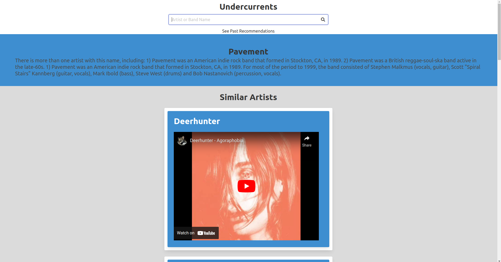
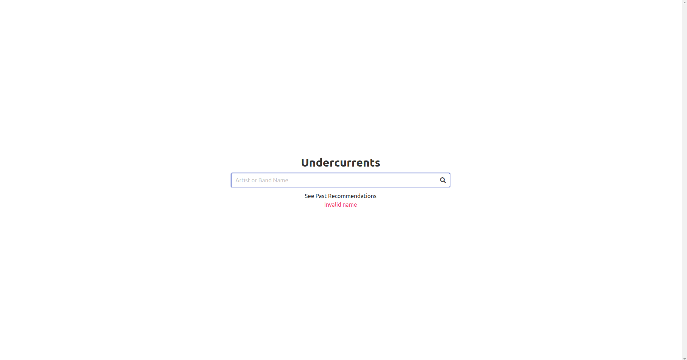
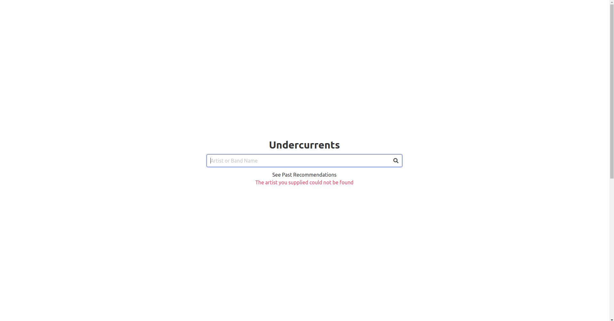

# Undercurrents

## Description
Find artists similar to the ones you already love and give them a listen and a helping hand. Bulma CSS is being used to style the webpage. We're currently utilizing the Last.fm and YouTube API to deliver artists of a similar genre. Last FM API is used to find a user specified artisit, their bio and other similar artists. Using that information YouTube API is being used to acquire music videos of the similar artist. The application uses jQuery to update the html on the page. It uses JavaScript fetch method to connect and retrieve the necessary data from the APIs. The application has several error checking functionalities built into it as given below.

* When a blank name is submitted by the user.
* When a user specified artist name is not found in the LastFM database.
* When there is an error connecting to the LastFM API.
* When there is an error connecting to the YouTube API.

## Technologies Used
* Bulma
* Javascript
* HTML
* jQuery

## Screenshots
The following image shows the landing page of the application.

The following image shows the search result after the user enters an artist or band name.

The following image the past recomendations stored in the browsers local storage.

The following image shows the error message that the application displays when the user searches without entering a name

The following image shows the error message that the application displays when the artist name is not found in the database

## Roadmap
We're considering adding to the MVP at a later date.

## Team Members
The team working on this project:  
* Daniel Brackenbury
* Shantanu Mazumder
* Mustapha Taylor
* Jerwin Sauco
* Innocent Ngoy 

## Deployed Site
The deployed site of the applcation can be accessed by clicking [here](https://helpvisa.github.io/undercurrents/).

## Credits
The loading animation was acquired from hub.blogspot.com from an article by Clint Fontanella. It was modified for our application. The original article and the source code can be accessed by clicking [here](https://blog.hubspot.com/website/css-loading-animation).

---
